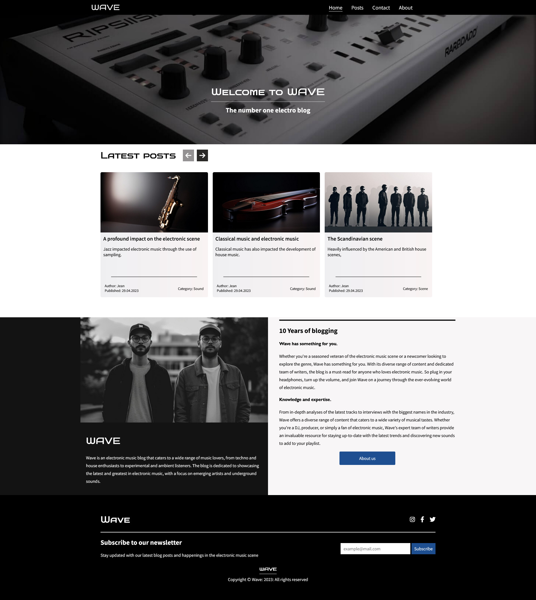

# Wave




## Description
Wave is a electronic music blog, made as my first year Exam, with focus on accessability, performance and responsive design.

## Features
- Search 
- Sort
- Contact-form 7 integration
- Post comments

## Built with

- HTML
- CSS
- Javascript
- Wordpress REST API
- Vite
- 
## Installation

Install my-project with npm

```bash
git clone https://github.com/Noroff-FEU-Assignments/project-exam-1-Jean-Christoffer.git

cd project-exam-1-Jean-Christoffer

npm install


```
    
